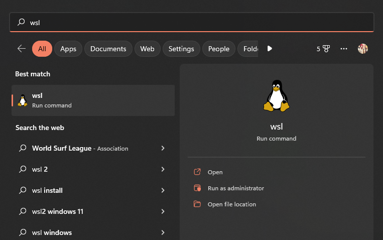
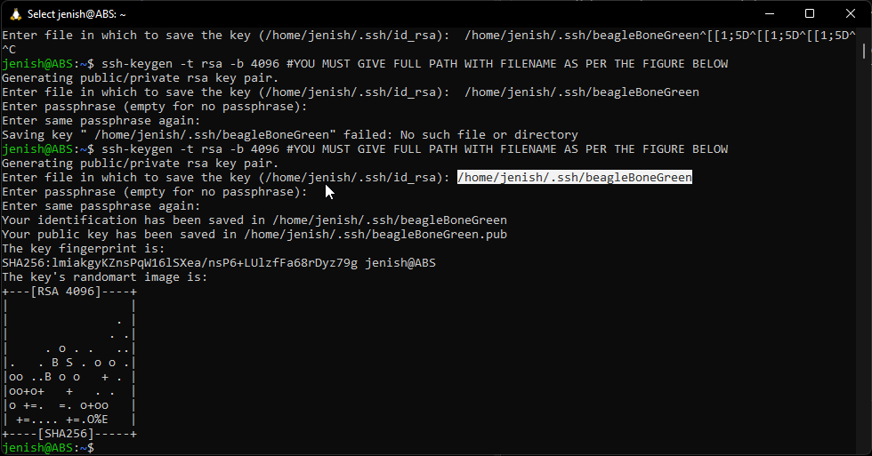
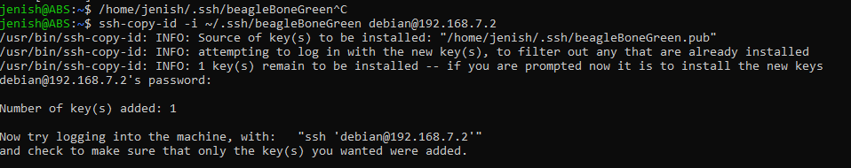

# Grading Script Guide

***If you have a newer Winodows, 10/11, then you need to disable signature verification for installing beagleBone drivers***

## Disable Signature Enforcement  on Windows 10/11

Follow this: https://youtu.be/C9M2l5vp5co

## Connect beagleBone to Windows Machine
You need to connect beagleBone to windows environment

Follow this tutorial: https://youtu.be/fzRVVtGNfj8?t=141


## Setting up WSL on Windows 10/11

Follow this: https://youtu.be/Rzg144v3hfo


Now you should have WSL running on your windows. Just go to wsl terminal

- This is how you open WSL terminal from Start Menu
- - 


- Copy and Paster following command on WSL Terminal

```
ssh-keygen -t rsa -b 4096 #WHEN ASKED, YOU MUST GIVE FULL PATH WITH FILENAME AS PER THE FIGURE BELO
```

- You will need to enter a path to save RSA public/private key pair. *YOU MUST GIVE FULL PATH WITH FILENAME AS PER THE FIGURE BELOW* Check the figure below to see the highlighted full path. You need to change user name (from ***jenish*** to whatever you have on your machine)
- - 

## Copying the Public Key to the Server

Now type following comamnd in WSL terminal
```
ssh-copy-id -i ~/.ssh/beagleBoneGreen debian@192.168.7.2
```

- You will see an OUTPUT on console as per figure below

- - 

Now, you can loginto BeagleBone without password requirement, using following command (TRY IT!).

```
ssh -i ~/.ssh/beagleBoneGreen debian@192.168.7.2
```

If something goes wrong follow the guide here: https://www.ssh.com/academy/ssh/keygen


# Running Python Script
